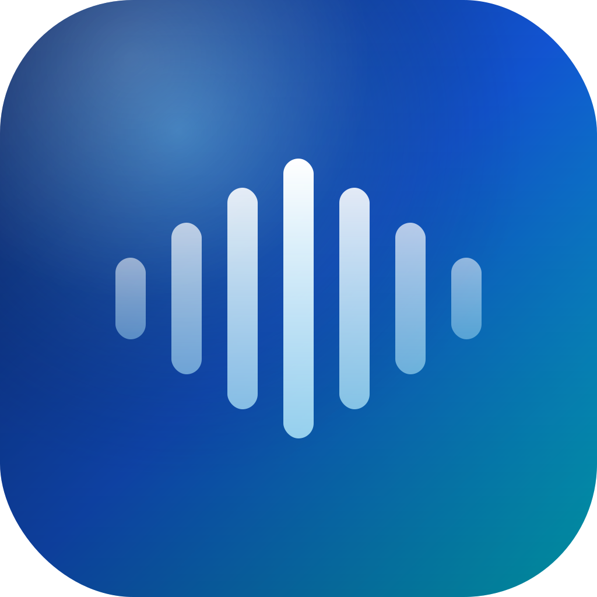

# Yap

Push-to-talk dictation for macOS. Hold a hotkey, speak, and text gets transcribed and pasted instantly.



## Features

- **Push-to-talk** — Hold `⌥Space` (customizable) to record, release to transcribe
- **Auto-paste** — Transcribed text is automatically inserted at your cursor
- **Multi-provider STT** — Groq (Whisper v3 Turbo), OpenAI (Whisper-1), Deepgram (Nova-3)
- **Vietnamese + English** — Auto-detect or lock to a specific language
- **Menu bar app** — Lives in your menu bar, always ready
- **Transcription history** — Copy any previous transcription with one click

## Requirements

- macOS 14.0+
- API key from one of: [Groq](https://console.groq.com), [OpenAI](https://platform.openai.com), or [Deepgram](https://console.deepgram.com)
- Accessibility permission (for auto-paste)
- Microphone permission

## Setup

```bash
# Install xcodegen if needed
brew install xcodegen

# Generate Xcode project
xcodegen generate

# Build and run
xcodebuild -project Yap.xcodeproj -scheme Yap -configuration Debug build
open ~/Library/Developer/Xcode/DerivedData/Yap-*/Build/Products/Debug/Yap.app
```

1. Open Yap from menu bar
2. Go to Settings → add your API key
3. Choose STT provider and language
4. Hold `⌥Space` and speak

## Tech Stack

- Swift / SwiftUI
- AVFoundation (audio capture)
- Cloud STT APIs (Groq / OpenAI / Deepgram)
- KeyboardShortcuts (hotkey management)

## License

Private — Son Piaz
